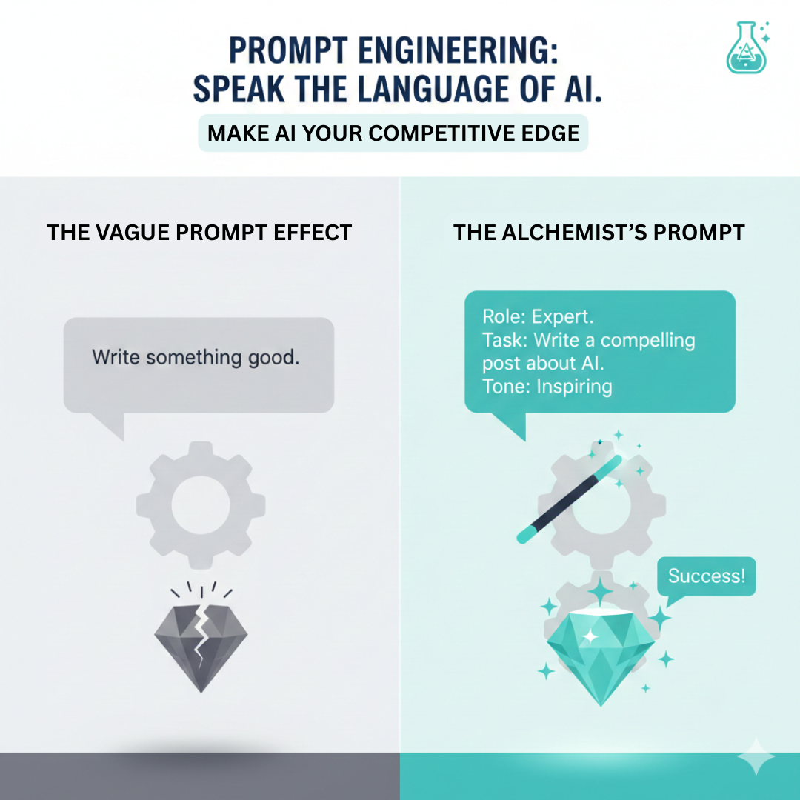

Plan ONE social media post for a specific social media channel (FacebookB, Instagram, LinkedIn or YouTube) for your company based on the best practices.

Choose ONE only. EITHER Facebook post, or Instagram post or, LinkedIn post or, YouTube video. Please follow all instructions exactly, and ensure that an image is included in your answer.

---

LinkedIn Post

Write a short LinkedIn text post to promote the company’s expertise.

TEXT/COPY:  
Prompting is becoming a core skill for the future of work.

At Prompt Alchemist, I help founders, working adults and students learn how to talk to AI tools properly, so they can save time and get better results.

If you’ve ever stared at a blank chat box not knowing what to type, I’ll show you simple prompt frameworks you can use right away.

Follow along if you want to turn AI into a real teammate, not just a toy.

HERO IMAGE (Insert screenshot):
- Screenshot of a laptop screen showing an AI chat (e.g. ChatGPT) with a clear prompt on the left and a strong, structured answer on the right, with the Prompt Alchemist name or logo visible.

HASHTAGS (please include 2 #hashtags):
- #PromptEngineering
- #FutureOfWork

CTA:

Most people talk *to* AI like this: "Write something good."

Then they wonder why the output is mid.

The problem isn’t the AI. It’s the *prompt*.

At Prompt Alchemist, we help founders, working adults and students learn how to “speak AI’s language” — using clear roles, tasks and tones so they get sharp, usable results instead of vague replies.

If you’ve ever stared at a blank chat box not knowing what to type, we’ll show you simple prompt frameworks you can use right away.

If you want to turn AI into a real teammate (not just a toy), join our community to learn the best prompting techniques.

Comment "prompts" if you’d like to join.

